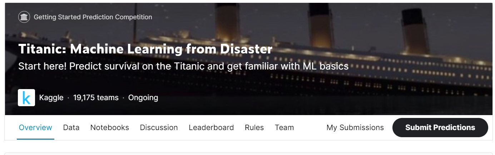
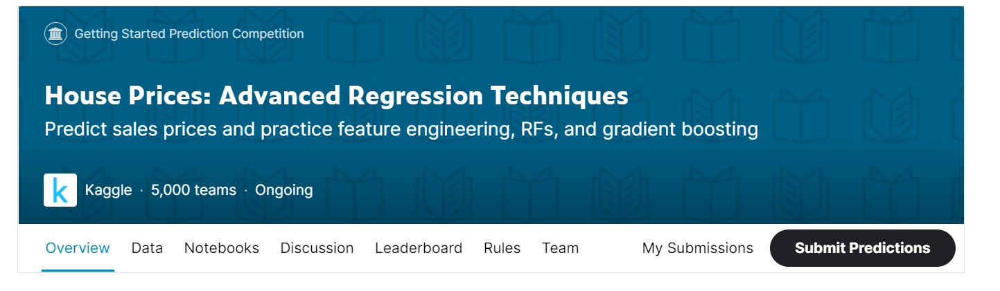
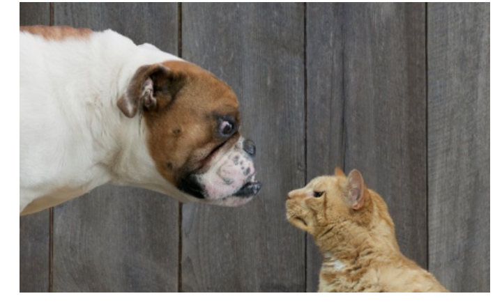
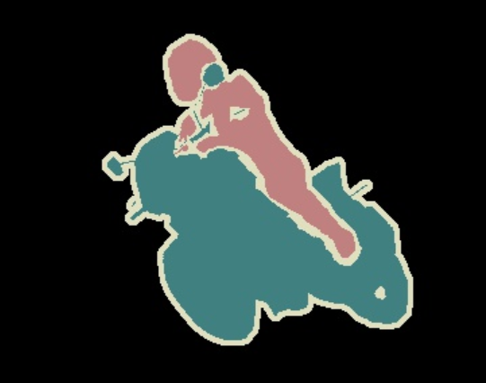
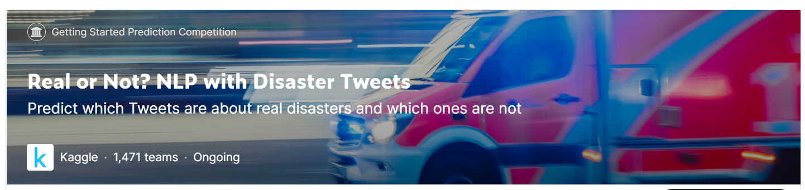

# GPNU_EUD
<h1 align="center">Data Science Leanring</h1>

    <h2 align="center">Eat Up Data</h2>

 @

 

## 简介

 

&nbsp;&nbsp;&nbsp;&nbsp;我们小组专注于零基础学习数据科学知识，主张以赛促学、项目促学，建立一个知识共享、互助成长的学习平台

 

## 涉及内容

- **[python的基础操作与基础库使用](#item1)**

    1. python基础
    2. numpy和pandas的使用
    3. matplotlib的使用，seaborn（进阶的可视化库）

- 机器学习理论与实践

    1. 机器学习理论
    2. 实践
    3. 。。。。
    4. 。。。。

- 深度学习理论与实践

    1. 深度学习理论
    2. Pytorch (TensorFlow暂定)
    3. CV && NLP

- 参加AI赛事、项目，以赛促学、项目促学

 

## 项目

- [Kaggle泰坦尼克号生存预测Baseline](https://github.com/mediocre-Lin/GPNU_EUD/tree/master/data-mining/Titanic)

- [阿里云天池街景字符识别（亚军）](https://github.com/mediocre-Lin/GPNU_EUD/tree/master/CV/TianChiOCR) 待整理上传

- [智算之道人工智能应用挑战赛(团队季军、Rank Top5)] 待整理上传

## 相关入门AI赛事和应用

### 1. 结构化数据挖掘

- **泰坦尼克号的沉没**:

    使用乘客数据（即姓名，年龄，性别，经济舱等）
    
    建立一个预测模型来解决以下问题：“什么样的人更有可能生存？” 

  
 

- **房屋价格的预测**:

    使用房屋的数据（即房屋信息，街区信息等）
    
    建立一个预测模型来解决以下问题：“预测房屋的销售价格”
    

### 2. 计算机视觉

- **猫狗分类问题**

    编写一种算法来对图像包含狗还是猫进行分类
    
    
 

  

- **目标检测**

  
- **语义分割**

### 3. 自然语言处理
- **推文态度分类（文本分类）**

    根据Twitter发布的内容建立一个模型，判断哪些是真实灾难的，哪些不是

- 问答
- 文本抽取
