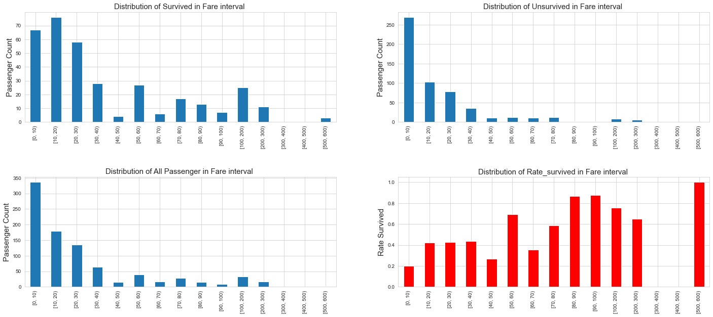
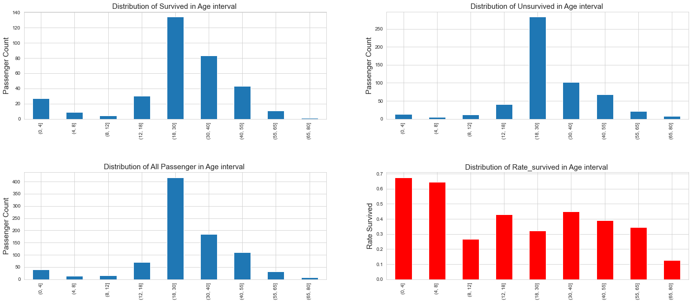
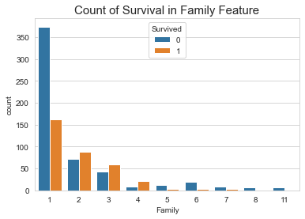
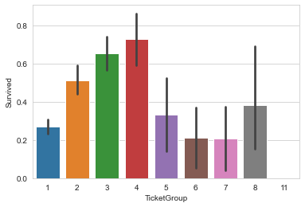

# 特征工程
特征工程很重要：数据和特征决定了机器学习的上限，而模型和算法只是逼近这个上限而已。


```python
#将数据合并一起处理,添加一个train特征用于区分训练集和测试集
train_data['train'] = 1
test_data['train'] = 0
data_all = pd.concat([train_data,test_data],sort=True).reset_index(drop=True)
```

### 对Fare的各个区间进行分析
对Fare进行区间划分之后，可以明显从区间的生存率看出，船票越高的游客幸存的机会更大


```python
## 提取幸存的和未幸存的
survived = train_data['Survived'] == 1
max_fare = train_data['Fare'].max()
print('max_fare:',max_fare)
Fare_survived=train_data[survived]['Fare']
Fare_Notsurvived=train_data[~survived]['Fare']


## 幸存 数据分桶：由于分布不均，在不同的区间选择了不同的划分
cut_list = list(range(0,100,10))
cut_list.extend(list(range(100,610,100)))
Fare_survived_cut=pd.cut(Fare_survived,cut_list,right=False)
Fare_survived_counts=Fare_survived_cut.value_counts(sort= False)

## 未幸存 数据分桶：由于分布不均，在不同的区间选择了不同的划分
Fare_Notsurvived_cut=pd.cut(Fare_Notsurvived,cut_list,right=False)
Fare_Notsurvived_counts=Fare_Notsurvived_cut.value_counts(sort=False)

## 幸存+未幸存
Passenger_Fare_counts = Fare_survived_counts+Fare_Notsurvived_counts
RateOfFare_survived_counts = Fare_survived_counts/Passenger_Fare_counts

plt.figure(figsize=(10,10))
plt.subplots_adjust(right=2,hspace =0.5)
plt.subplot(2,2,1)
Fare_survived_counts.plot.bar()
plt.title('Distribution of Survived in Fare interval ',size=15)
plt.ylabel('Passenger Count',size=15)
plt.subplot(2,2,2)
Fare_Notsurvived_counts.plot.bar()
plt.title('Distribution of Unsurvived in Fare interval ',size=15)
plt.ylabel('Passenger Count',size=15)

plt.subplot(2,2,3)
Passenger_Fare_counts.plot.bar()
plt.title('Distribution of All Passenger in Fare interval ',size=15)
plt.ylabel('Passenger Count',size=15)

plt.subplot(2,2,4)
RateOfFare_survived_counts.plot.bar(color='r')
plt.title('Distribution of Rate_survived in Fare interval ',size=15)
plt.ylabel('Rate Survived',size=15)
plt.show()
```

    max_fare: 512.3292
    





### 对Age的各个区间进行分析
对Age划分区间进行分析后，发现幼儿的生存机会似乎更大


```python
## 提取幸存的和未幸存的
survived = train_data['Survived'] == 1
max_age = train_data['Age'].max()
print('max_age:',max_age)
Age_survived=train_data[survived]['Age']
Age_Notsurvived=train_data[~survived]['Age']


## 幸存 
## 未成年进行了细分
cut_list = [0,4,8,12,18,30,40,55,65,80]

Age_survived_cut=pd.cut(Age_survived,cut_list,right=True)
Age_survived_counts=Age_survived_cut.value_counts(sort=False)

## 未幸存 
Age_Notsurvived_cut=pd.cut(Age_Notsurvived,cut_list,right=True)
Age_Notsurvived_counts=Age_Notsurvived_cut.value_counts(sort=False)

## 幸存+未幸存
Passenger_Age_counts = Age_survived_counts+Age_Notsurvived_counts
RateOfAge_survived_counts = Age_survived_counts/Passenger_Age_counts

plt.figure(figsize=(10,10))
plt.subplots_adjust(right=2,hspace =0.5)
plt.subplot(2,2,1)
Age_survived_counts.plot.bar()
plt.title('Distribution of Survived in Age interval ',size=15)
plt.ylabel('Passenger Count',size=15)
plt.subplot(2,2,2)
Age_Notsurvived_counts.plot.bar()
plt.title('Distribution of Unsurvived in Age interval ',size=15)
plt.ylabel('Passenger Count',size=15)

plt.subplot(2,2,3)
Passenger_Age_counts.plot.bar()
plt.title('Distribution of All Passenger in Age interval ',size=15)
plt.ylabel('Passenger Count',size=15)

plt.subplot(2,2,4)
RateOfAge_survived_counts.plot.bar(color='r')
plt.title('Distribution of Rate_survived in Age interval ',size=15)
plt.ylabel('Rate Survived',size=15)
plt.show()
```

    max_age: 80.0
    





### Fare ，Age
对连续的特征进行离散化，得到粗粒度的特征

对Fare，Age分桶操作


```python
cut_list = list(range(0,100,10))
cut_list.extend(list(range(100,700,100)))
Fare_cut=pd.cut(data_all['Fare'],cut_list,labels=False,right=False)
data_all['Fare_bin']=Fare_cut
cut_list = [0,4,8,12,18,30,40,55,65,80]
Age_cut=pd.cut(data_all['Age'],cut_list,labels=False)
data_all['Age_bin']=Age_cut
data_all[['Age','Age_bin','Fare','Fare_bin']].head()
```


<div>

<table border="1" class="dataframe">
  <thead>
    <tr style="text-align: right;">
      <th></th>
      <th>Age</th>
      <th>Age_bin</th>
      <th>Fare</th>
      <th>Fare_bin</th>
    </tr>
  </thead>
  <tbody>
    <tr>
      <th>0</th>
      <td>22.0</td>
      <td>4</td>
      <td>7.2500</td>
      <td>0</td>
    </tr>
    <tr>
      <th>1</th>
      <td>38.0</td>
      <td>5</td>
      <td>71.2833</td>
      <td>7</td>
    </tr>
    <tr>
      <th>2</th>
      <td>26.0</td>
      <td>4</td>
      <td>7.9250</td>
      <td>0</td>
    </tr>
    <tr>
      <th>3</th>
      <td>35.0</td>
      <td>5</td>
      <td>53.1000</td>
      <td>5</td>
    </tr>
    <tr>
      <th>4</th>
      <td>35.0</td>
      <td>5</td>
      <td>8.0500</td>
      <td>0</td>
    </tr>
  </tbody>
</table>
</div>


### SibSp、Parch

SibSp和Parch的幸存率大致分布一致，可以考虑将他们合并成一个Family(SibSp+Parch+1)特征

- 可以看出Family ==1 时，幸存率很低
- Family == 2 ,3, 4 的幸存率高
- Family == 5 ,6 ,7 的幸存率很低
- Family > 7 几乎没有幸存


```python
survived = train_data['Survived'] == 1
train_data['Family']=train_data['SibSp']+train_data['Parch']+1
sns.countplot(x='Family', hue='Survived', data=train_data)
plt.title('Count of Survival in Family Feature',size=15)
```


    Text(0.5, 1.0, 'Count of Survival in Family Feature')





### SibSp,Parch
SibSp和Parch的幸存率大致分布一致，可以考虑将他们合并成一个Family(SibSp+Parch+1)特征
- Family值为1时，即代表单身人士：single
- Family值为2,3,4时，即代表小型的家庭：small
- Family值为5,6,7时，即代表中型的家庭：medium
- Family值大于7时，代表大型的家庭:Large


```python
data_all['Family']=data_all['SibSp']+data_all['Parch']+1
Family_category_map = {1: 'Single', 2: 'Small', 3: 'Small', 4: 'Small', 5: 'Medium', 6: 'Medium', 7: 'Medium', 8: 'Large', 11: 'Large'}
data_all['Family_category'] = data_all['Family'].map(Family_category_map)
```


```python
data_all[['Family_category','Family']].head()
```


<div>

<table border="1" class="dataframe">
  <thead>
    <tr style="text-align: right;">
      <th></th>
      <th>Family_category</th>
      <th>Family</th>
    </tr>
  </thead>
  <tbody>
    <tr>
      <th>0</th>
      <td>Small</td>
      <td>2</td>
    </tr>
    <tr>
      <th>1</th>
      <td>Small</td>
      <td>2</td>
    </tr>
    <tr>
      <th>2</th>
      <td>Single</td>
      <td>1</td>
    </tr>
    <tr>
      <th>3</th>
      <td>Small</td>
      <td>2</td>
    </tr>
    <tr>
      <th>4</th>
      <td>Single</td>
      <td>1</td>
    </tr>
  </tbody>
</table>
</div>


### Name
从名字中可以看出一些乘船人的身份


```python
data_all['Title'] = data_all['Name'].apply(lambda x:x.split(',')[1].split('.')[0].strip())
Title_Dictionary = {
    "Capt": "Officer",
    "Col": "Officer",
    "Major": "Officer",
    "Jonkheer": "Royalty",
    "Don": "Royalty",
    "Sir" : "Royalty",
    "Dr": "Officer",
    "Rev": "Officer",
    "the Countess":"Royalty",
    "Mme": "Mrs",
    "Mlle": "Miss",
    "Ms": "Mrs",
    "Mr" : "Mr",
    "Mrs" : "Mrs",
    "Miss" : "Miss",
    "Master" : "Master",
    "Lady" : "Royalty"
}
data_all['Title'] = data_all['Title'].map(Title_Dictionary)
data_all[['Name','Title']].head()
```


<div>

<table border="1" class="dataframe">
  <thead>
    <tr style="text-align: right;">
      <th></th>
      <th>Name</th>
      <th>Title</th>
    </tr>
  </thead>
  <tbody>
    <tr>
      <th>0</th>
      <td>Braund, Mr. Owen Harris</td>
      <td>Mr</td>
    </tr>
    <tr>
      <th>1</th>
      <td>Cumings, Mrs. John Bradley (Florence Briggs Th...</td>
      <td>Mrs</td>
    </tr>
    <tr>
      <th>2</th>
      <td>Heikkinen, Miss. Laina</td>
      <td>Miss</td>
    </tr>
    <tr>
      <th>3</th>
      <td>Futrelle, Mrs. Jacques Heath (Lily May Peel)</td>
      <td>Mrs</td>
    </tr>
    <tr>
      <th>4</th>
      <td>Allen, Mr. William Henry</td>
      <td>Mr</td>
    </tr>
  </tbody>
</table>
</div>


```python
data_all.head()
```


<div>

<table border="1" class="dataframe">
  <thead>
    <tr style="text-align: right;">
      <th></th>
      <th>Age</th>
      <th>Embarked</th>
      <th>Fare</th>
      <th>Name</th>
      <th>Parch</th>
      <th>Pclass</th>
      <th>Sex</th>
      <th>SibSp</th>
      <th>Survived</th>
      <th>Ticket</th>
      <th>Title</th>
      <th>train</th>
      <th>Fare_bin</th>
      <th>Age_bin</th>
      <th>Family</th>
      <th>Family_category</th>
    </tr>
  </thead>
  <tbody>
    <tr>
      <th>0</th>
      <td>22.0</td>
      <td>2</td>
      <td>7.2500</td>
      <td>Braund, Mr. Owen Harris</td>
      <td>0</td>
      <td>3</td>
      <td>1</td>
      <td>1</td>
      <td>0.0</td>
      <td>A/5 21171</td>
      <td>Mr</td>
      <td>1</td>
      <td>0</td>
      <td>4</td>
      <td>2</td>
      <td>Small</td>
    </tr>
    <tr>
      <th>1</th>
      <td>38.0</td>
      <td>0</td>
      <td>71.2833</td>
      <td>Cumings, Mrs. John Bradley (Florence Briggs Th...</td>
      <td>0</td>
      <td>1</td>
      <td>0</td>
      <td>1</td>
      <td>1.0</td>
      <td>PC 17599</td>
      <td>Mrs</td>
      <td>1</td>
      <td>7</td>
      <td>5</td>
      <td>2</td>
      <td>Small</td>
    </tr>
    <tr>
      <th>2</th>
      <td>26.0</td>
      <td>2</td>
      <td>7.9250</td>
      <td>Heikkinen, Miss. Laina</td>
      <td>0</td>
      <td>3</td>
      <td>0</td>
      <td>0</td>
      <td>1.0</td>
      <td>STON/O2. 3101282</td>
      <td>Miss</td>
      <td>1</td>
      <td>0</td>
      <td>4</td>
      <td>1</td>
      <td>Single</td>
    </tr>
    <tr>
      <th>3</th>
      <td>35.0</td>
      <td>2</td>
      <td>53.1000</td>
      <td>Futrelle, Mrs. Jacques Heath (Lily May Peel)</td>
      <td>0</td>
      <td>1</td>
      <td>0</td>
      <td>1</td>
      <td>1.0</td>
      <td>113803</td>
      <td>Mrs</td>
      <td>1</td>
      <td>5</td>
      <td>5</td>
      <td>2</td>
      <td>Small</td>
    </tr>
    <tr>
      <th>4</th>
      <td>35.0</td>
      <td>2</td>
      <td>8.0500</td>
      <td>Allen, Mr. William Henry</td>
      <td>0</td>
      <td>3</td>
      <td>1</td>
      <td>0</td>
      <td>0.0</td>
      <td>373450</td>
      <td>Mr</td>
      <td>1</td>
      <td>0</td>
      <td>5</td>
      <td>1</td>
      <td>Single</td>
    </tr>
  </tbody>
</table>
</div>


### Ticket
提取Ticket特征,一张Ticket可以供多人使用


```python
Ticket_Count = dict(data_all['Ticket'].value_counts())
data_all['TicketGroup'] = data_all['Ticket'].apply(lambda x:Ticket_Count[x])
sns.barplot(x='TicketGroup', y='Survived', data=data_all)
```


    <AxesSubplot:xlabel='TicketGroup', ylabel='Survived'>





```python
## 处理类别特征
def process_category_feature(data,category_feature=None):
    for feature in category_feature:   
        # onehot
        feature_dummies = pd.get_dummies(data[feature], prefix=feature)
        data = pd.concat([data, feature_dummies],axis=1)
        ## 删除
        data.drop(feature,axis=1,inplace=True)
    return data
```


```python
data_all=process_category_feature(data_all,category_feature=['Pclass','Embarked','Title','Family_category','Fare_bin','Age_bin','Sex'])
```


```python
data_all.drop(['Name','Ticket','SibSp','Parch'],axis=1,inplace=True)
```


```python
#对数据进行归一化处理
import sklearn.preprocessing as preprocessing
scaler = preprocessing.StandardScaler()
##Age
age_scale = scaler.fit(data_all['Age'].values.reshape(-1, 1))
data_all['Age'] = age_scale.transform(data_all['Age'].values.reshape(-1, 1))
##Fare
fare_scale = scaler.fit(data_all['Fare'].values.reshape(-1, 1))
data_all['Fare'] = scaler.transform(data_all['Fare'].values.reshape(-1, 1))
```


```python
train_data = data_all[data_all['train']==1]
test_data = data_all[data_all['train']==0]
y=train_df['Survived'].values
train_data.drop(['train','Survived'],axis=1,inplace=True)
test_data.drop(['train','Survived'],axis=1,inplace=True)
```


```python
train_data.info()
```

    <class 'pandas.core.frame.DataFrame'>
    Int64Index: 891 entries, 0 to 890
    Data columns (total 43 columns):
     #   Column                  Non-Null Count  Dtype  
    ---  ------                  --------------  -----  
     0   Age                     891 non-null    float64
     1   Family                  891 non-null    int64  
     2   Fare                    891 non-null    float64
     3   Pclass_1                891 non-null    uint8  
     4   Pclass_2                891 non-null    uint8  
     5   Pclass_3                891 non-null    uint8  
     6   Embarked_0              891 non-null    uint8  
     7   Embarked_1              891 non-null    uint8  
     8   Embarked_2              891 non-null    uint8  
     9   Title_Master            891 non-null    uint8  
     10  Title_Miss              891 non-null    uint8  
     11  Title_Mr                891 non-null    uint8  
     12  Title_Mrs               891 non-null    uint8  
     13  Title_Officer           891 non-null    uint8  
     14  Title_Royalty           891 non-null    uint8  
     15  Family_category_Large   891 non-null    uint8  
     16  Family_category_Medium  891 non-null    uint8  
     17  Family_category_Single  891 non-null    uint8  
     18  Family_category_Small   891 non-null    uint8  
     19  Fare_bin_0              891 non-null    uint8  
     20  Fare_bin_1              891 non-null    uint8  
     21  Fare_bin_2              891 non-null    uint8  
     22  Fare_bin_3              891 non-null    uint8  
     23  Fare_bin_4              891 non-null    uint8  
     24  Fare_bin_5              891 non-null    uint8  
     25  Fare_bin_6              891 non-null    uint8  
     26  Fare_bin_7              891 non-null    uint8  
     27  Fare_bin_8              891 non-null    uint8  
     28  Fare_bin_9              891 non-null    uint8  
     29  Fare_bin_10             891 non-null    uint8  
     30  Fare_bin_11             891 non-null    uint8  
     31  Fare_bin_14             891 non-null    uint8  
     32  Age_bin_0               891 non-null    uint8  
     33  Age_bin_1               891 non-null    uint8  
     34  Age_bin_2               891 non-null    uint8  
     35  Age_bin_3               891 non-null    uint8  
     36  Age_bin_4               891 non-null    uint8  
     37  Age_bin_5               891 non-null    uint8  
     38  Age_bin_6               891 non-null    uint8  
     39  Age_bin_7               891 non-null    uint8  
     40  Age_bin_8               891 non-null    uint8  
     41  Sex_0                   891 non-null    uint8  
     42  Sex_1                   891 non-null    uint8  
    dtypes: float64(2), int64(1), uint8(40)
    memory usage: 62.6 KB
    


```python
print('train_data Shape',train_data.shape)
print('test_data Shape',test_data.shape)
```

    train_data Shape (891, 43)
    test_data Shape (418, 43)
    

